<div align="center">

# RedNoise

**A from-scratch C++23 software renderer: the Cornell box, rendered every way there is.**

[](https://github.com/ReverseZoom2151/rednoise/actions)
[](LICENSE)


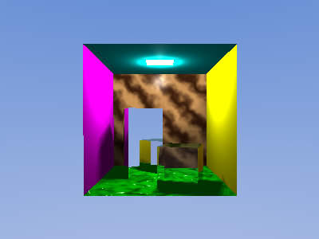

</div>

A CPU software renderer written in C++23. It draws into a plain pixel buffer (no
GPU, no OpenGL) and, for the interactive app, presents it with SDL3; it uses glm
for vector and matrix maths. It began as the University of Bristol computer
graphics coursework ("RedNoise" is the first milestone) and grew into a renderer
with seven ways to draw the Cornell box: a rasteriser, a Whitted ray tracer, a
Monte-Carlo path tracer, a photon mapper, a classic radiosity solver, a
bidirectional path tracer, and a Metropolis light transport sampler.

Everything is verified end to end: the SDL-free engine is unit-tested and
rendered headlessly in CI, which uploads the resulting images as build
artifacts.

## Gallery

All images below are output from this renderer. The last row renders the
reference course scene assets (the Stanford bunny, the Bristol logo, and the rich
Cornell scene) from the COMS30020 coursework with our engine.

<table>
<tr>
<td align="center"><br><sub><b>Ray tracer</b>: mirror, glass, marble, bump, soft shadows</sub></td>
<td align="center">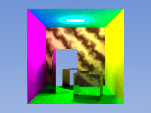<br><sub><b>Path tracer</b>: global illumination, colour bleeding</sub></td>
<td align="center">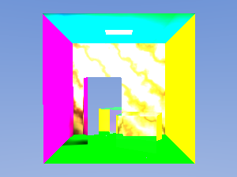<br><sub><b>Photon mapping</b>: caustics through the glass box</sub></td>
</tr>
<tr>
<td align="center">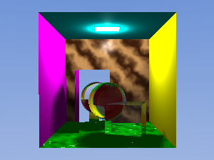<br><sub><b>Spectral dispersion</b>: a prism splits white light</sub></td>
<td align="center">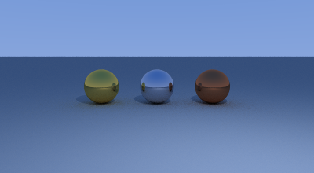<br><sub><b>PBR metals</b>: metallic / roughness (gold, chrome, copper)</sub></td>
<td align="center">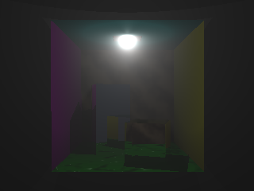<br><sub><b>Participating media</b>: volumetric light shafts</sub></td>
</tr>
<tr>
<td align="center">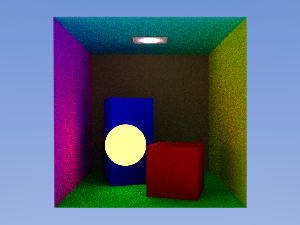<br><sub><b>Emissive geometry</b>: a glowing sphere lights the room</sub></td>
<td align="center">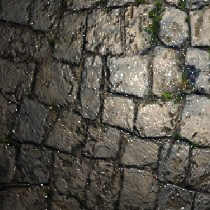<br><sub><b>Normal mapping</b>: tangent-space relief from a texture</sub></td>
<td align="center">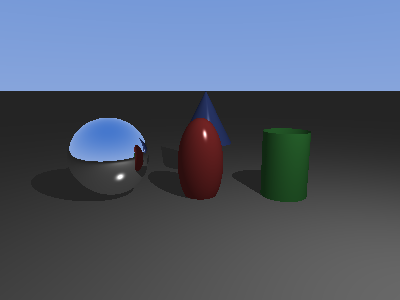<br><sub><b>Analytic primitives</b>: sphere, plane, ellipsoid, cylinder, cone</sub></td>
</tr>
<tr>
<td align="center">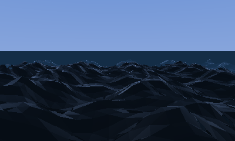<br><sub><b>Gerstner ocean</b>: glass water with Fresnel reflection</sub></td>
<td align="center">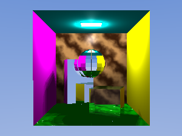<br><sub><b>Disco ball</b>: a faceted mirror sphere</sub></td>
<td align="center">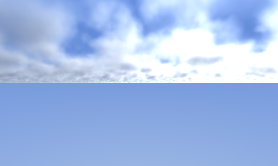<br><sub><b>Volumetric clouds</b>: fractal density raymarch</sub></td>
</tr>
<tr>
<td align="center">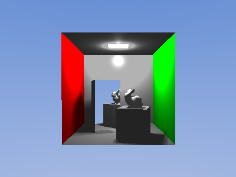<br><sub><b>Stanford bunny</b>: a classic mesh in the Cornell box</sub></td>
<td align="center">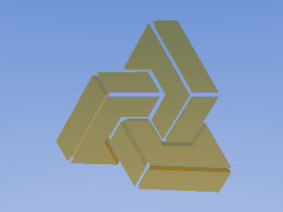<br><sub><b>Bristol logo</b>: the reference asset with its original texture</sub></td>
<td align="center">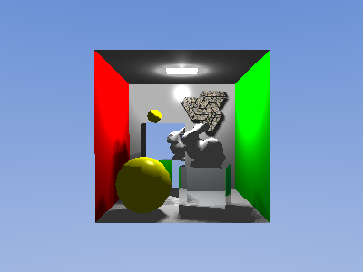<br><sub><b>Rich Cornell scene</b>: bunny, spheres and logo (704 triangles)</sub></td>
</tr>
</table>

## About

RedNoise began as the first milestone of the University of Bristol COMS30020
Computer Graphics unit, where "RedNoise" is literally a window full of random red
pixels. From that starting point it grew, feature by feature, into a renderer
that draws the Cornell box essentially every way the field knows how: a
rasteriser, a Whitted ray tracer, a Monte-Carlo path tracer, a photon mapper,
classic and progressive radiosity, bidirectional path tracing, Metropolis light
transport, and a real-time OpenCL GPU path tracer.

It is the union of four reference course implementations plus more: every
technique taught or demonstrated across those units (rasterisation, all the
global-illumination methods, PBR materials, sub-surface scattering, participating
media, mipmapping, stencil shadows, the meshing/decimation toolkit, analytic
quadrics, spectral and Gerstner oceans, volumetric clouds, and the acceleration
structures) is implemented here, then packaged as an installable library with a
stable C ABI. Each feature was verified by actually looking at a render and by
unit tests, and the whole thing is exercised in CI on every push.

## Features

Rendering modes:

- Wireframe, and a z-buffered rasteriser with full frustum clipping, optional
  backface culling, and a shadow-mapping variant.
- Whitted ray tracer: reflection, refraction, Fresnel, hard and soft shadows.
- Monte-Carlo path tracer: global illumination (colour bleeding), soft shadows,
  and anti-aliasing together.
- Photon mapper: indirect light and caustics, with an optional final gather.
- An OpenCL GPU path tracer that runs the same scene on the GPU in real time
  (progressive accumulation; ~800 fps at 320x240 on an RTX A4000).

Global illumination solvers:

- Classic finite-element radiosity (patch subdivision, Monte-Carlo gathering).
- Bidirectional path tracing (camera and light subpaths, connected).
- Metropolis light transport (PSSMLT: a Markov chain over path space).

Shading and lighting:

- Flat, Gouraud, and Phong shading with per-vertex normals.
- Proximity + angle-of-incidence diffuse, specular highlights, ambient floor.
- Point, directional, and spot lights; area lights give soft shadows; a
  volumetric (3D sphere) emitter gives a wide penumbra.

Materials:

- Diffuse, mirror, glass (Snell + Fresnel), and metallic/roughness (PBR).
- Textured (Wavefront `map_Kd`), procedural (Perlin) and bump/parallax mapping.
- A library of named presets (gold, chrome, copper, emerald, jade, ruby, and
  the classic plastics and rubbers).

Geometry and scenes:

- OBJ/MTL loading with per-vertex normals; analytic spheres, planes, ellipsoids,
  cylinders and cones alongside triangles.
- Object transforms, instancing, and distance-based level of detail.
- A fractal-terrain (Perlin heightfield) generator and an animated
  Gerstner-wave ocean surface.

Camera and image:

- Perspective projection, lookAt, orbit, free-fly, mouse-look, and roll.
- Depth of field and motion blur (in the path tracer).
- Tone-mapping, FXAA, and bloom post-filters; supersampling anti-aliasing.

Performance and output:

- A BVH acceleration structure and OpenMP multithreading.
- PPM/BMP screenshots and numbered PPM frame sequences for video.

See [ROADMAP.md](ROADMAP.md) for the phased build history. Every item on it,
including the GPU path tracer and the ocean-water simulation, is built.

## Dependencies

<div align="center">
&nbsp;&nbsp;&nbsp;&nbsp;
&nbsp;&nbsp;&nbsp;&nbsp;
&nbsp;&nbsp;&nbsp;&nbsp;
&nbsp;&nbsp;&nbsp;&nbsp;
&nbsp;&nbsp;&nbsp;&nbsp;

</div>

No dependency version is pinned, and there is nothing to install by hand. The
default is **find-first, then fetch**: for each dependency the build looks for a
system package first (instant if you already have it) and only fetches the latest
from upstream when it is missing. So `cmake -B build && cmake --build build` just
works whether or not you have the libraries installed.

| | Dependency | How it's resolved | Notes |
|-|------------|-------------------|-------|
|  | [glm](https://github.com/g-truc/glm) | System package, else fetched | Header-only; `third_party/glm` is the offline fallback |
|  | [SDL3](https://www.libsdl.org) | System package (vcpkg / distro), else fetched + built | Only the interactive app |
|  | [OpenCL SDK](https://github.com/KhronosGroup/OpenCL-ICD-Loader) | System SDK (vendor / CUDA), else fetched Khronos headers + loader | Only the GPU path tracer |
|  | OpenCL runtime | GPU driver | Cannot be fetched: it is the vendor's driver; keep the driver current |
|  | [OpenMP](https://www.openmp.org) | Compiler | Cannot be fetched: it is a compiler feature (libgomp/libomp/vcomp); optional |

Knobs, if you want to override the default:

- `-DFETCHCONTENT_TRY_FIND_PACKAGE_MODE=NEVER` force-fetches the newest of
  everything, ignoring any system copies.
- `-DFETCH_DEPENDENCIES=OFF` never fetches; it uses only system packages and the
  vendored glm (fully offline).

A C++23 compiler is required (GCC 13+, Clang 17+, or MSVC 19.34+), plus CMake
3.24+ and git. Fetching needs network at configure time.

## Building

Run any binary from the repository root so the relative `assets/` paths resolve.

### CMake (recommended, cross-platform)

```sh
cmake -B build -S . -DCMAKE_BUILD_TYPE=Release
cmake --build build --config Release
./build/RedNoise            # Windows/MSVC: .\build\Release\RedNoise.exe
```

On Windows with [vcpkg](https://vcpkg.io), install SDL3 and point CMake at the
toolchain:

```sh
vcpkg install sdl3
cmake -B build -S . -DCMAKE_BUILD_TYPE=Release \
      -DCMAKE_TOOLCHAIN_FILE=<vcpkg-root>/scripts/buildsystems/vcpkg.cmake
```

### Makefile (Linux/macOS)

Requires `clang++` and SDL3 discoverable via `pkg-config sdl3`:

```sh
make            # debug build, then runs
make production # optimised build
make clean
```

### Headless renderer and tools (no SDL3)

The engine builds without a window. This is what CI runs; it needs no SDL3:

```sh
cmake -B build -S . -DBUILD_APP=OFF
cmake --build build
ctest --test-dir build --output-on-failure          # unit tests

./build/render_headless assets/cornell-box.obj out   # wireframe/rasterised/raytraced PPMs
./build/render_headless assets/cornell-box.obj out 64 # + a 64-sample path-traced PPM
./build/gen_terrain assets/terrain.obj               # generate a fractal terrain mesh
./build/animate assets/cornell-box.obj frame 36      # orbiting camera -> frame-000.ppm ...
./build/render_ocean ocean 24                        # 24 animated ocean frames
```

### GPU path tracer (OpenCL)

Optional and vendor-neutral: standard OpenCL, no CUDA. It builds against whatever
OpenCL SDK is installed (any vendor's, or the Khronos headers + ICD loader; the
CUDA toolkit bundles one) and runs on any conformant device - discrete or
integrated GPU, or even a CPU OpenCL runtime. It enumerates all devices, prefers
a GPU but falls back to anything, and lets you pick. Progressive accumulation
means weaker hardware just converges over more frames rather than failing, so the
same binary scales from a laptop iGPU to a workstation card.

```sh
cmake -B build -S . -DBUILD_GPU=ON      # find_package(OpenCL), uses newest SDK
cmake --build build
./build/gpu_pathtracer --list                                   # list OpenCL devices
./build/gpu_pathtracer assets/cornell-box.obj gpu.ppm 320 240 8 120     # render (auto device)
./build/gpu_pathtracer assets/cornell-box.obj gpu.ppm 320 240 8 120 1   # ... on device index 1
```

The code uses the OpenCL 1.2 API subset for the broadest reach but runs on newer
runtimes (3.0, etc.) at full speed. Require a newer runtime by raising the target
level: `cmake -B build -DBUILD_GPU=ON -DOPENCL_TARGET_VERSION=300`.

## Using it as a library (C API)

The engine installs as a self-contained library with a stable C ABI
(`include/rednoise/rednoise.h`) that exposes no C++ or glm types, so it links
from C and binds cleanly from Rust, Python, and others.

```sh
cmake -B build -S . -DBUILD_APP=OFF
cmake --build build
cmake --install build --prefix /your/prefix
```

Then from a downstream CMake project (`find_package` gives `rednoise::rednoise`):

```cmake
find_package(rednoise REQUIRED)
add_executable(app app.c)
target_link_libraries(app PRIVATE rednoise::rednoise)
# the engine is C++, so the consuming project enables CXX for the link step
```

```c
#include <rednoise/rednoise.h>
rn_scene *scene = rn_scene_load_obj("cornell-box.obj", 0.35f);
unsigned char rgba[320 * 240 * 4];
rn_render(scene, RN_PATHTRACED, 320, 240, 4.0f, 64, rgba);
rn_scene_free(scene);
```

A complete example is in `examples/c_consumer.c`. This C API is also the surface
future Rust / Python / WASM bindings target.

## Controls (interactive app)

| Input | Action |
|-------|--------|
| `1` / `2` / `3` / `G` | Wireframe / rasterised / ray-traced / path-traced |
| `4` / `5` / `6` | Flat / Gouraud / Phong shading (ray tracer) |
| `W` `A` `S` `D` `Q` `E` | Move the camera |
| Arrow keys, or left-drag | Rotate the camera (pan / tilt) |
| `Z` / `X` | Roll the camera (tilt the horizon) |
| `L` / `O` / `R` | Aim at the scene centre / toggle orbit / reset |
| `C` | Toggle backface culling (rasteriser) |
| `P` | Save the frame to `output.ppm` |
| `Esc` | Quit |

## Project structure

```
rednoise/
├── src/                    # the renderer engine + application
│   ├── RedNoise.cpp        #   application: window loop, input, render-mode switch
│   ├── Camera / Renderer   #   projection; wireframe/raster/ray/path/photon renderers
│   ├── Radiosity / BDPT / Metropolis  #   the three GI solvers
│   ├── Geometry / BVH / Scene    #   intersection, acceleration, analytic primitives
│   ├── Light / Photon / Noise    #   lights, photon map, Perlin noise
│   ├── Materials / ObjLoader / Transform  #   presets, OBJ/MTL loading, instancing, LOD
│   ├── Ocean / Noise             #   Gerstner-wave ocean, Perlin noise
│   ├── capi.cpp                  #   C ABI implementation
│   └── Interpolation / Drawing   #   maths + line/triangle/texture drawing
├── include/rednoise/       # public C API header (installed)
├── examples/               # c_consumer.c (uses the C ABI)
├── cmake/                  # rednoiseConfig.cmake.in (package config)
├── gpu/                    # OpenCL GPU path tracer: pathtracer.cl + host
├── framework/             # the "sdw" teaching framework (headers + sources together)
│   ├── DrawingWindow.*     #   SDL3 window (the only SDL dependency)
│   ├── Canvas.*            #   SDL-free pixel buffer + PPM save
│   └── CanvasPoint.* CanvasTriangle.* Colour.* ModelTriangle.*
│       RayTriangleIntersection.* TextureMap.* TexturePoint.* Utils.*
├── third_party/glm/       # vendored glm (offline fallback; latest is fetched by default)
├── tools/                 # render_headless, gen_terrain, animate
├── tests/                 # CTest unit tests (SDL-free)
├── assets/                # cornell-box.obj/.mtl, sphere.obj, terrain.obj, texture.ppm
├── .github/workflows/     # CI: format check, tests, render, syntax check
├── CMakeLists.txt · Makefile · CMakePresets.json
```

## Editor setup

The repo ships a `compile_flags.txt` so clangd resolves the `framework/`,
`third_party/`, and `src/` include paths without a build. Building once
(`cmake -B build`) additionally writes `build/compile_commands.json`, which
clangd prefers and which carries your machine's SDL3 include path.

## Credits and licence

The `framework/` "sdw" classes originate from the University of Bristol Computer
Graphics unit (COMS30020). The project's own code is under the MIT
[LICENSE](LICENSE); vendored dependencies keep their own licences, listed in
[THIRD_PARTY_NOTICES.md](THIRD_PARTY_NOTICES.md).
